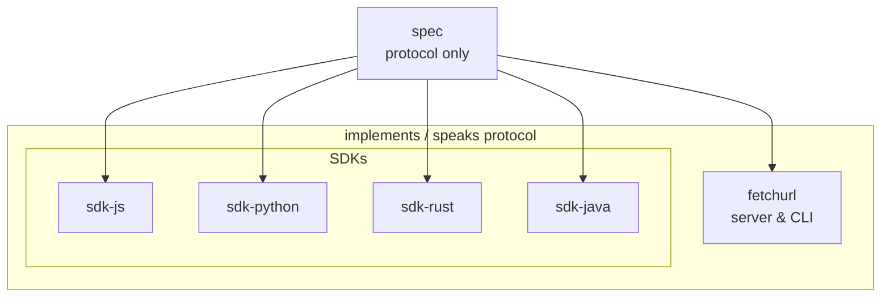

# fetchurl

Content-addressable URL caching for CI and package managers.

Clients ask a cache server for `algo/hash` and pass source URLs; the server fetches, verifies, and stores. Servers are **untrusted** — clients always verify hashes. Designed for repeated dependency downloads without MITM proxies or fragile workflow-cache keys.

Normative behavior lives in the **[protocol spec](https://github.com/fetchurl/spec)**; everything else implements it.

## Repositories

### Protocol

- **[spec](https://github.com/fetchurl/spec)** — normative protocol (`SPEC.md`), versioned independently

### Server

- **[fetchurl](https://github.com/fetchurl/fetchurl)** — reference server & CLI (Go), container image `ghcr.io/fetchurl/fetchurl`

### SDKs

- **[sdk-js](https://github.com/fetchurl/sdk-js)** — JavaScript / TypeScript (`fetchurl-sdk`)
- **[sdk-python](https://github.com/fetchurl/sdk-python)** — Python (`fetchurl-sdk`)
- **[sdk-rust](https://github.com/fetchurl/sdk-rust)** — Rust (`fetchurl-sdk`)
- **[sdk-java](https://github.com/fetchurl/sdk-java)** — Java (`io.github.fetchurl:fetchurl-sdk`)

## Quick orientation

- **Run a cache:** [fetchurl/fetchurl](https://github.com/fetchurl/fetchurl) — image `ghcr.io/fetchurl/fetchurl`
- **Wire a client:** set `FETCHURL_SERVER` to the server base URL (ready to append `/:algo/:hash`); see [spec](https://github.com/fetchurl/spec/blob/main/SPEC.md)
- **Propose protocol changes:** issues/PRs on [spec](https://github.com/fetchurl/spec)
- **Implementation bugs:** the relevant server or SDK repo

## Links

- Protocol: [fetchurl/spec](https://github.com/fetchurl/spec)
- Org: [github.com/fetchurl](https://github.com/fetchurl)
